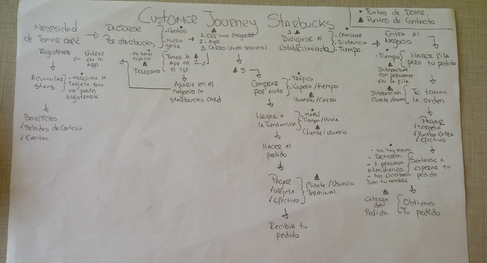

# starbucks-cj

### Costumer Journey (Starbucks)

### Descripción del proceso

* Procedi a describir el recorrido del cliente en 3 diferentes maneras.
* El primero fue directamente en el establecimiento (offline).
* La segunda fue mediante una app (online).
* Por último por el autoservicio (offline).

En la parte superior derecha se puede observar una pequeña leyenda donde con dos simpbolos identifico :
* Puntos de dolor.
La imagen de un triángulo para los puntos de contacto.

